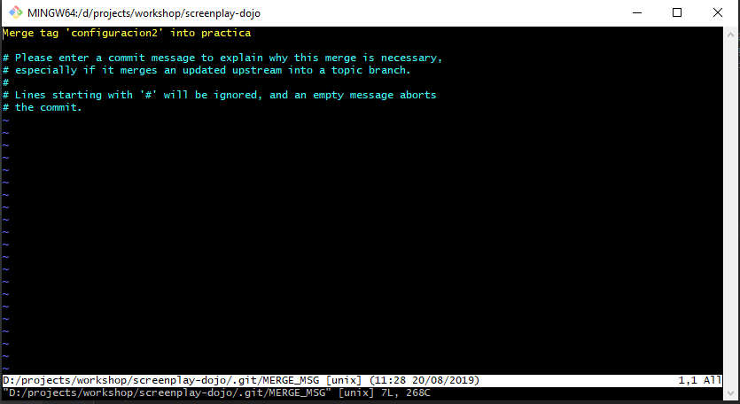
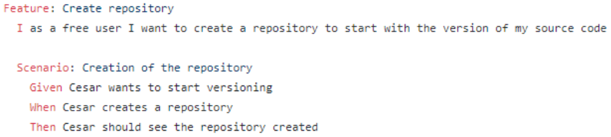
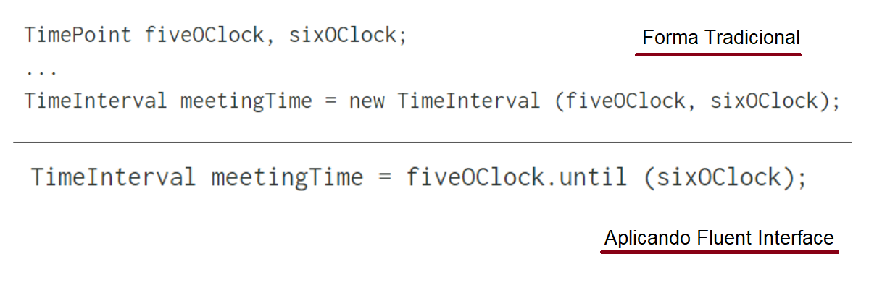
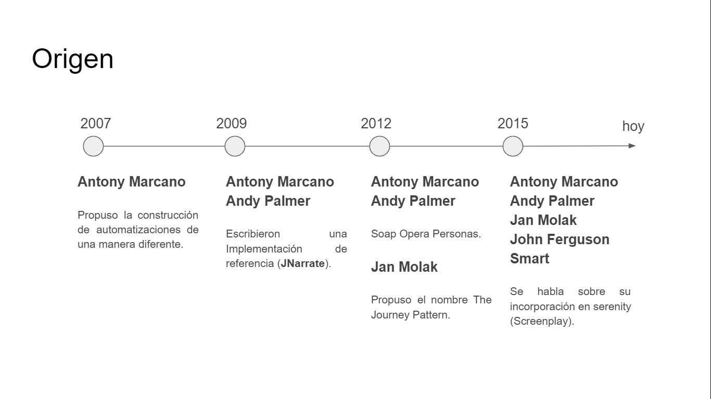

# Screenplay - dojo
Este dojo es un punto de partida para todas aquellas personas que quieran aprender acerca de la construcción 
de automatizaciones para pruebas funcionales de aplicaciones Web.

Para configurar el ambiente necesario para realizar este dojo puedes seguir la siguiente guía:

https://cedaniel200.blogspot.com/2019/08/configurando-mi-ambiente-de.html 

En este el proyecto se podran encontrar más de 50 pasos como comentarios **TODO** que guiarán el dojo.
Si en algún momento te quedas atascado, no te preocupes en la rama solucion encontrarás tags, cada uno de estos tags agrupa una serie 
de pasos relacionados entre sí, por lo cual solo debes buscar el tag donde esta tu paso y seguir desde ahí.

Para lo anterior utilizar el comando:

    git merge tag_name
        
En caso de que Git solicite un mensaje para el merge como se observa en la imagen.

puedes oprimir la tecla Escape **ESC** seguido de **:wq** y **Enter**.

### Para correr el proyecto 

Una vez terminado cada uno de los pasos del dojo se podrá ejecutar con el comando
    
    clean test aggregate 
    
Este es el comando que correrá los tests y generará el reporte en la carpeta /target/site/serenity/

### NOTA

Lee la teoría a continuación antes de empezar con el dojo.

## Teoría a tener en cuenta

### ¿Qué es un test?
Es un conjunto de actividades manuales o automatizadas que buscan dar información sobre la calidad del software.

### Piramide de Automatización

Para este punto los invito a leer el artículo https://www.mountaingoatsoftware.com/blog/the-forgotten-layer-of-the-test-automation-pyramid

### Programación Orientada a Objetos

Es un paradigma de programación (es una propuesta tecnológica adoptada por una comunidad de desarrolladores)
* Clases (La definición de un Objeto, Plantilla o Molde)
* Objetos
    * Instancia de una clase
    * Atributos (Estado) y Métodos (Comportamientos)
* Mensajes y Métodos 
    * Para realizar una tarea se debe enviar un mensaje, para que una clase o un objeto procese el mensaje que recibe, debe poseer un método de coincidencia
* Interfaz (Contrato)
    * En las interfaces se especifica qué se debe hacer pero no su implementación.
    
Caracteristicas:

* Herencia
    * Mecanismo para diseñar dos o más entidades que son diferentes pero comparten muchas características (estado y/o comportamiento) comunes.
* Encapsulamiento
    * Reunir elementos pertenecientes a una misma entidad.
    * Ocultar el estado
* Polimorfismo
    * Permite que una sola variable se refiere a objetos de diferentes clases.
    * Permite enviar el mismo mensaje a objetos de diferentes clases.
    * Nos ayuda a escribir código que es fácil de modificar y ampliar.
* Abstracción
    * Expresa las características (estado y/o comportamiento) esenciales de un objeto

### Principios SOLID

Acrónimo introducido por Robert C. Martin (autor de libro Clean Code y coautor del manifiesto Ágil), este acrónimo representa 5 principios claves en la programación Orientada a Objetos.
* Single responsibility (Principio de Responsabilidad Única)
    * Un módulo debería tener una, y solo una, razón para cambiar.
* Open-Closed (Principio de Abierto/Cerrado)
    * Un artefacto de software debe estar abierto para su extensión, pero cerrado para su modificación.
* Liskov substitution (Principio de Sustitución de Liskov)
    * Las clases Base deben poder usar objetos de clases derivadas sin conocerlos. Es decir los tipos derivados son completamente sustituibles por sus tipos base.
* Interface segregation (Principio de Segregación de la Interfaz )
    * Ninguna clase debería depender de métodos que no usa. En caso contrario, es mejor tener varias interfaces más pequeñas.
* Dependency inversion (Principio de Inversión de Dependencia)
    * Los módulos de alto nivel no deben depender de los módulos de bajo nivel.
    
### Behavior-driven development (BDD)

Es un enfoque de colaboración para el desarrollo de software que cierra la brecha de comunicación entre el negocio y  TI. Con BDD se escriben pruebas que verifican que el comportamiento del código es correcto desde el punto de vista de negocio.

Principales prácticas:

* Talleres de Descubrimiento
    * Reuniones breves y frecuentes donde se reúnen negocios y TI para obtener un entendimiento común de cómo debe comportarse el software.
* Especificación por ejemplo (SbE) 
    * Los ejemplos concretos se expresan como especificaciones de software (escenarios) ejecutables para verificar automáticamente que el software se comporta como se espera.
* Desarrollo guiado por pruebas (TDD)

### Gherkin

Es un conjunto simple de reglas gramaticales (DSL) que hacen que el texto plano sea lo suficientemente estructurado para que una herramienta que admita el desarrollo impulsado por comportamiento lo entienda.

Las palabras clave son:
* Feature
* Scenario
* Given, When, Then, And, But (steps)
* Background
* Scenario Outline (o Scenario Template)
* Examples

También hay algunas palabras clave secundarias:
* """ (Doc Strings)
* | (Data Tables)
* @ (Tags)
* \# (Comments)

### Cucumber

Es una herramienta que admite el desarrollo impulsado por el comportamiento (BDD) .
Cucumber lee especificaciones ejecutables escritas en texto plano y valida que el software haga lo que dichas especificaciones dicen. Las especificaciones constan de múltiples ejemplos , o escenarios.

### Fluent Interface

Es un estilo que conlleva realizar diseños legibles y fluidos. El precio de esta fluidez es más esfuerzo, tanto en el pensamiento como en la propia construcción de API.

### Screenplay

Patrón para escribir **pruebas de aceptación automatizadas de alta calidad basadas en buenos principios de ingeniería de software**, como el Principio de Responsabilidad Única, el Principio Abierto-Cerrado y el uso efectivo de Capas de Abstracción.
Está centrado en el usuario. ayuda a cambiar el enfoque de las pruebas de aceptación automatizadas de las interacciones de bajo nivel con el sistema a pensar en:

* ¿Quiénes son los usuarios de su sistema?
* ¿Qué es lo que quieren lograr mediante su interacción con su sistema?
* ¿Cómo exactamente lo van a hacer?

Fomenta la producción de prueba altamente legibles, mantenibles y fáciles de extender.

Separación de preocupaciones.

* Roles 		-> ¿Para quién es esto? 
* Objetivos 	-> ¿Por qué están aquí y qué resultado esperan?
* Tareas 		-> ¿Qué deberán hacer para lograr estos objetivos? 
* Acciones 		-> ¿Cómo completar cada tarea a través de interacciones específicas?

Estructura

Al finalizar el dojo obtendras una estructura completa del proyecto similar a la siguiente:

    + exception
        Clases que controlan las posibles excepciones técnicas y de negocios que se presentan durante la ejecución de pruebas
    + model
        Clases relacionadas con el modelo de dominio y sus respectivos builder cuando es necesario
    + task
        Clases que representan tareas que realiza el actor a nivel de proceso de negocio
    + interaction
        Clases que representan las interacciones directas con la interfaz de usuario
    + userinterface
        Page Objects y Page Elements. Mapean los objetos de la interfaz de usuario
    + question
        Objetos usados para consultar acerca del estado de la aplicación
    + util
        Clases de utilidad
    + runner
        Clases que permiten correr los tests
    + step definition
        Clases que mapean las líneas Gherkin a código java
    + features
        La representación de las historias en archivos cucumber
        
### Referencias

http://thucydides.info/docs/serenity-staging/#_serenity_and_the_screenplay_pattern

https://cucumber.io/docs/guides/bdd-tutorial/

https://cucumber.io/docs/cucumber/api/

https://cucumber.io/docs/gherkin/reference/

as